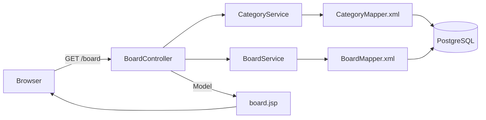

# 철학 자유게시판 (kamel-loewe-kind)

> 철학을 좋아하는 사람들이 모여 자유롭게 생각을 나누는 게시판입니다.

화면 기획 → DB 설계 → 백엔드/프론트 구현 순서로 진행 중인 개인 학습 프로젝트입니다.


## 목차

- [프로젝트 소개](#프로젝트-소개)
- [기술 스택](#기술-스택)
- [주요 기능](#주요-기능)
- [시스템 아키텍처](#시스템-아키텍처)
- [기술적 의사결정 과정](#기술적-의사결정-과정)
- [ERD](#erd)
- [설계 의도](#설계-의도)
- [엔티티·DTO 설계 의도](#엔티티dto-설계-의도)
- [문제해결 사례](#문제해결-사례)

## 프로젝트 소개

Spring MVC와 MyBatis를 실전처럼 다뤄보기 위해 시작한 개인 학습 프로젝트입니다. 실무 절차를 흉내 내어 **화면 기획서 작성 → DB 스키마 설계 → 백엔드 구현** 순서로 진행하며, 각 단계에서 내린 판단과 그 이유를 코드와 문서에 남기는 것을 목표로 합니다.

- 화면 기획서(`docs/`): 게시판 목록·보기·등록·수정·비밀번호 확인 5개 화면의 와이어프레임과 기획 의도를 정리했습니다.
- DB 설계(`schema.sql`): `category`, `board`, `comment`, `attachment` 4개 테이블과 외래키 제약을 설계했습니다.
- 백엔드 구현: 현재 카테고리 목록 조회와 게시판 목록 검색(카테고리 필터/통합 검색어/등록일 기간) 기능까지 구현되어 있으며, 게시글 상세·등록·수정·삭제와 댓글·첨부파일 기능은 순차적으로 구현할 예정입니다.

## 기술 스택

| 구분 | 스택 |
|---|---|
| Language | Java 17 |
| Framework | Spring Boot 3.5, Spring MVC |
| Persistence | MyBatis 3.x |
| Database | PostgreSQL |
| View | JSP, JSTL (Tomcat Embed Jasper) |
| Build | Gradle (war 패키징) |
| Test | JUnit 5, Spring Boot Test (`@SpringBootTest` 기반 Mapper 통합 테스트) |
| 기타 | Lombok |

## 주요 기능

**구현 완료**

- 게시판 목록 조회: 카테고리별 필터링, 제목/작성자/내용 통합 검색, 등록일 기간 검색을 조합한 조건 검색
- 카테고리 목록 조회: 목록 화면 상단 드롭다운에 노출할 카테고리 목록 조회

**기획·설계 완료, 구현 예정**

- 게시글 상세 보기 (조회수 증가 포함)
- 게시글 등록 / 수정
- 게시글 삭제 전 비밀번호 확인 (페이지 이동 없이 `fetch()` 기반 부분 처리)
- 댓글, 첨부파일 (DB 스키마 설계 완료, 게시글 삭제 시 `CASCADE` 자동 정리)

## 시스템 아키텍처

계층은 `Controller → Service → Mapper(MyBatis) → PostgreSQL`로 이어지며, 화면 렌더링은 JSP가 `Model`에 담긴 데이터를 받아 처리합니다.



테이블 컬럼과 1:1로 대응하는 엔티티(`Board`, `Category`)와, 여러 테이블을 조합해야 하는 화면 전용 응답(`BoardListResponseDto`, `CategoryResponseDto`)을 분리한 이유는 [엔티티·DTO 설계 의도](#엔티티dto-설계-의도)에서 자세히 다룹니다.

## 기술적 의사결정 과정

배포 방식을 정하면서 조사하고 내린 결정들을, 나중에도 왜 그렇게 정했는지 알 수 있도록 [ADR(Architecture Decision Record)](https://github.com/architecture-decision-record/architecture-decision-record) 형식(맥락 → 결정 → 결과)으로 정리했습니다. DB를 PostgreSQL로 바꾸는 작업은 반영이 끝났고, DB/앱 호스팅(Neon, Cloud Run)은 아직 구현 계획 단계입니다.

| 결정 | 한 줄 요약 |
|---|---|
| DB: MySQL → PostgreSQL | 무료로 쓸 수 있는 관리형 DB 서비스 대부분이 PostgreSQL 위주로 재편되어 있어서 |
| DB 호스팅: Neon | Supabase/Render Postgres 대비 무기한 무료이면서 유휴 후 재개가 가장 빠름 |
| 앱 호스팅: Cloud Run | 무료 한도가 넉넉하고, 컨테이너만 만들면 되는 배포 방식이라 관리 부담이 적어서 |
| Vercel 미채택 | Spring Boot 같은 상시 구동 JVM 서버를 지원하는 실행 모델이 아니라서 |

<details>
<summary><b>DB를 MySQL에서 PostgreSQL로 바꾸기로 한 이유</b></summary>

**맥락**: 로컬 개발은 MySQL로 진행해왔지만, 실제 배포하려니 무료로 쓸 수 있는 관리형 MySQL 호스팅이 마땅치 않았습니다. Render, Neon, Supabase 등 최근 무료 티어를 제공하는 서비스 대부분이 PostgreSQL을 기본으로 밀고 있고, MySQL 무료 티어는 대부분 사라진 상태였습니다.

**결정**: 배포용 DB를 PostgreSQL로 바꾸기로 했습니다. MyBatis는 JPA/Hibernate 같은 ORM이 아니라 SQL을 직접 실행하는 매핑 프레임워크라서, DB를 바꿔도 SQL 자체가 표준 SQL 위주라면 큰 무리 없이 이식할 수 있다는 점을 먼저 확인하고 내린 결정입니다.

**결과**: `schema.sql`의 MySQL 전용 문법 두 가지(`AUTO_INCREMENT` → `GENERATED ALWAYS AS IDENTITY`, `DATETIME` → `TIMESTAMP`)를 고쳤고, `data.sql`의 `INSERT IGNORE`도 PostgreSQL에 없는 문법이라 `ON CONFLICT (name) DO NOTHING`으로 바꿨습니다. `build.gradle`의 드라이버(`mysql-connector-j` → `postgresql`)와 `application.yml`의 연결 정보도 함께 바꿨습니다. `BoardMapper.xml`/`CategoryMapper.xml`의 쿼리와 테스트 코드의 `JdbcTemplate` INSERT문은 `EXISTS`, `LIKE CONCAT` 같은 표준 SQL 위주라 MySQL 전용 함수가 없어서 손대지 않고 그대로 재사용했습니다.

</details>

<details>
<summary><b>DB 호스팅으로 Neon을 고른 이유</b></summary>

**맥락**: 무료 관리형 PostgreSQL 후보로 Neon, Supabase, Render Postgres를 비교했습니다.

| 후보 | 무료 조건 | 문제점 |
|---|---|---|
| Render Postgres | 무료 인스턴스 제공 | 90일 후 만료 — 개인 프로젝트로 오래 쓰기엔 부적합 |
| Supabase | DB 500MB, Auth 등 부가 기능 포함 | 1주일 미사용 시 프로젝트가 일시정지되고 수동으로 재개해야 함 |
| Neon | 프로젝트당 3GB, 유휴 시 컴퓨트가 0으로 줄어듦 | 재개가 쿼리 유입 시 자동으로, 거의 즉시 이뤄짐 |

**결정**: 만료 기한이 없고 유휴 후 재개도 자동으로 빠른 **Neon**을 선택했습니다. 이 프로젝트는 텍스트 위주 게시판(첨부파일도 파일명만 DB에 저장)이라 3GB만으로도 게시글 수십만 건을 저장할 수 있어 용량은 문제가 되지 않습니다.

**결과**: Neon은 SSL 연결(`sslmode=require`)을 강제하고, Cloud Run처럼 여러 인스턴스가 동시에 뜰 수 있는 환경에서는 커넥션 수 제한에 걸리지 않도록 PgBouncer가 내장된 `-pooler` 엔드포인트를 써야 합니다.

</details>

<details>
<summary><b>앱 호스팅으로 Cloud Run을 고른 이유</b></summary>

**맥락**: Spring Boot 서버(WAR/내장 톰캣)를 올릴 곳으로 Oracle Cloud Always Free VM(직접 서버 관리), Render/Railway(관리형이지만 무료 티어 제약), Google Cloud Run(컨테이너 기반 관리형)을 비교했습니다.

**결정**: **Cloud Run**을 선택했습니다. Oracle Cloud는 기한 없이 무료라는 장점이 있지만 Docker·방화벽·HTTPS 인증서까지 직접 관리해야 해서 부담이 크고, Render/Railway는 슬립(유휴 시 정지)이나 크레딧 소진 같은 무료 티어 제약이 있습니다. Cloud Run은 월 200만 요청·36만 GB-초 등 무료 한도가 넉넉하고, 컨테이너 이미지만 만들면 git 연동으로 자동 배포할 수 있어 관리 부담과 무료 한도 사이에서 가장 균형이 맞았습니다.

**결과**:
- 현재 WAR로 패키징된 앱을 담을 `Dockerfile`을 새로 작성해야 합니다.
- Spring Boot(JVM)는 콜드 스타트가 5~15초로 느린 편이라, 오래 방치 후 첫 접속은 느릴 수 있습니다.
- 2026년 2월부터 무료 티어여도 결제 계정(카드) 연결이 필수라, 예산 알림을 설정해 실수로 과금되는 걸 방지해야 합니다.
- Cloud Run 인스턴스는 상태를 저장하지 않아서(stateless), 나중에 첨부파일 업로드를 구현할 때 로컬 디스크가 아니라 Google Cloud Storage(무료 5GB) 같은 외부 저장소를 써야 합니다.

</details>

<details>
<summary><b>Vercel을 앱 서버로 쓰지 않기로 한 이유</b></summary>

**맥락**: 프론트를 나중에 React로 바꿀 가능성을 염두에 두고 Vercel도 검토했습니다.

**결정**: Vercel에서 **Spring Boot 서버 자체를 실행하는 건 채택하지 않았습니다.** Vercel은 요청마다 떴다가 사라지는 서버리스 함수 실행 모델이 기본이라, 포트를 계속 붙잡고 DB 커넥션 풀을 유지해야 하는 Spring Boot의 상시 구동 서버 모델과 맞지 않습니다. 최근 Dockerfile 배포를 지원하기 시작했지만, 이것도 결국 Vercel Functions의 실행 시간·메모리 제한 안에서 도는 방식이라 근본적인 차이는 없습니다.

**결과**: 지금(JSP 기반 모놀리식) 구조에서는 Vercel이 낄 자리가 없어 해당 사항이 없습니다. 다만 나중에 프론트를 React로 분리하면 **React 프론트는 Vercel에, Spring Boot는 계속 Cloud Run에** 배포하는 조합으로 갈 계획입니다. 이 경우 서로 다른 도메인 간 통신이 되므로 Spring Boot 쪽에 CORS 설정을 추가해야 합니다.

</details>

**참고 자료**

- [Best PostgreSQL Hosting in 2026: RDS vs Supabase vs Neon vs Self-Hosted](https://dev.to/philip_mcclarence_2ef9475/best-postgresql-hosting-in-2026-rds-vs-supabase-vs-neon-vs-self-hosted-5fkp)
- [Which managed Postgres databases have a free tier — Neon FAQs](https://neon.com/faqs/managed-postgres-databases-free-tier)
- [Cloud Run Quotas and Limits](https://docs.cloud.google.com/run/quotas)
- [How to Optimize Cloud Run Cold Start Latency for Java and Spring Boot](https://oneuptime.com/blog/post/2026-02-17-how-to-optimize-cloud-run-cold-start-latency-for-java-and-spring-boot-applications/view)
- [Can you use Vercel for backend? — Northflank](https://northflank.com/blog/vercel-backend-limitations)
- [Storage pricing | Google Cloud](https://cloud.google.com/storage/pricing)

## ERD

추후 추가 예정입니다.

## 설계 의도

`schema.sql`을 작성하면서 내린 판단 중, 코드만 봐서는 이유가 드러나지 않는 것들을 정리했습니다.

| 결정 | 한 줄 요약 |
|---|---|
| 외래키에 이름을 직접 지정 | 에러 메시지·수정 시점에 어떤 제약인지 바로 알아보기 위해 |
| `updated_at`을 자동 갱신하지 않음 | 조회수 증가까지 "수정"으로 오인되는 걸 막기 위해 |
| `board → category`는 RESTRICT | 카테고리는 게시글과 독립적으로 의미 있는 데이터라서 |
| `comment/attachment → board`는 CASCADE | 게시글에 완전히 종속된 데이터라서 |

<details>
<summary><b>외래키 제약에 이름을 직접 붙인 이유</b></summary>

`fk_board_category`, `fk_comment_board`, `fk_attachment_board`처럼 모든 외래키 제약에 `fk_테이블_참조테이블` 패턴으로 이름을 직접 붙였습니다. 이름을 안 붙여도 MySQL이 알아서 이름을 지어주지만, 알아보기 어려운 자동 생성 이름 대신 의미가 드러나는 이름을 쓰면 두 가지가 편해집니다.

- 제약 위반으로 에러가 났을 때, 에러 메시지에 이 이름이 그대로 나와서 어떤 관계 때문에 실패했는지 바로 알 수 있습니다.
- 나중에 `ALTER TABLE ... DROP FOREIGN KEY fk_board_category`처럼 특정 제약만 콕 집어 수정하거나 삭제할 때, 예측 가능한 이름으로 바로 참조할 수 있습니다.

</details>

<details>
<summary><b><code>updated_at</code>을 자동으로 채우지 않은 이유</b></summary>

`updated_at`은 `ON UPDATE CURRENT_TIMESTAMP` 같은 자동 갱신을 쓰지 않고, `NULL`을 허용하는 컬럼으로만 두었습니다. 대신 게시글을 실제로 수정하는 쿼리에서만 애플리케이션이 직접 값을 채웁니다.

이유는 게시글 보기 화면에서 조회수를 올리는 동작도 `board` 테이블에 대한 UPDATE이기 때문입니다. 자동 갱신을 걸어두면 글을 조회만 해도 `updated_at`이 채워져서, "수정한 적 없는 글은 '-'로 표기한다"는 화면 요구사항과 어긋나게 됩니다. 조회수 갱신과 실제 수정을 DB가 구분하지 못하는 상황을 피하기 위해, 수정일시는 의도적으로 수동 관리합니다.

</details>

<details>
<summary><b><code>board → category</code>를 RESTRICT로 둔 이유</b></summary>

카테고리는 게시글이 없어도 그 자체로 의미가 있는 데이터입니다(분류 체계). 그래서 게시글이 참조하고 있는 카테고리를 실수로 지우는 상황을 막기 위해, 기본 동작(RESTRICT)을 그대로 두었습니다. 참조 중인 카테고리를 삭제하려 하면 DB가 거부합니다.

</details>

<details>
<summary><b><code>comment → board</code>, <code>attachment → board</code>를 CASCADE로 둔 이유</b></summary>

댓글과 첨부파일은 게시글 없이는 존재할 이유가 없는, 게시글에 완전히 종속된 데이터입니다. 게시글이 삭제되면 이 데이터들도 함께 정리되는 게 자연스러워서 `ON DELETE CASCADE`를 걸었습니다. 이렇게 하면 게시글만 지워도 댓글·첨부파일 행이 자동으로 같이 삭제되어, "게시글은 없는데 댓글만 남아있는" 고아 데이터가 생기지 않습니다.

단, CASCADE는 DB 안의 행만 정리해줄 뿐 서버에 실제로 업로드된 파일까지 지워주지는 않습니다. 첨부파일의 실제 삭제는 애플리케이션 코드에서 별도로 처리해야 합니다.

</details>

## 엔티티·DTO 설계 의도

게시판 목록 조회(`BoardMapper.search`)를 구현하면서 내린 판단들입니다.

<details>
<summary><b><code>Board</code> 엔티티에 <code>hasAttachment</code>를 넣지 않은 이유</b></summary>

JPA였다면 `@OneToMany`로 첨부파일과의 연관관계를 엔티티에 선언해두고, 필요할 때 Hibernate가 알아서 조회해서 채워줬을 겁니다. 하지만 MyBatis에는 이런 자동 fetch 메커니즘이 없습니다 — 리턴 타입에 필드를 선언해봤자, 그 쿼리의 SELECT 결과에 없으면 그냥 기본값(`false`)으로 남을 뿐입니다.

문제는 여기서 끝나지 않습니다. `Board`를 결과 타입으로 쓰는 다른 쿼리(등록, 수정, 단건 조회 등)에서는 `hasAttachment`가 항상 `false`로 채워진 채 반환되는데, 이건 단순히 "비어있다"가 아니라 "실제로는 첨부파일이 있는데도 없다고 잘못 알려주는" 조용한 버그로 이어질 수 있습니다.

그래서 `board` 테이블과 1:1로 대응하는 `Board`는 테이블 컬럼만 그대로 담는 역할로 한정하고, 카테고리 이름·첨부파일 존재 여부처럼 여러 테이블을 조합해야 나오는 값은 목록 화면 전용 `BoardListResponseDto`에만 두었습니다. `Board`는 등록/수정/삭제 등 여러 쿼리에서 재사용되는 안정적인 형태로 유지하고, `BoardListResponseDto`는 오직 목록 화면 하나만을 위한 조합이라는 걸 명확히 구분한 것입니다.

</details>

<details>
<summary><b>쿼리 결과와 응답 DTO 사이에 별도 Row 계층을 두지 않은 이유</b></summary>

MyBatis 쿼리 결과를 한 번 더 감싸는 중간 객체(Row)를 만들고, 그걸 다시 `BoardSearchResponseDto`로 변환하는 계층을 추가하는 방법도 있었습니다. 하지만 지금 단계에서는 쿼리 결과 컬럼과 화면에 필요한 필드가 사실상 1:1이라, 중간 계층을 추가해봤자 코드만 한 겹 늘고 관리 포인트만 늘어난다고 판단해 생략했습니다.

대신 이 결정에는 명확한 대가가 있습니다. XML의 SELECT 컬럼(별칭)과 DTO 필드명이 문자열로만 연결되기 때문에, 나중에 DTO 필드명을 바꾸면서 XML의 별칭을 같이 안 고치면 컴파일 에러 없이 그 필드만 조용히 null/기본값으로 빠지는 사고가 날 수 있습니다. 이런 실수를 컴파일 시점이 아니라 최소한 테스트 시점에는 잡기 위해, DB에 실제로 값을 넣고 쿼리를 돌려 필드까지 검증하는 통합 테스트(`@SpringBootTest` 기반)를 방어선으로 두었습니다.

</details>

## 문제해결 사례

구현하면서 실제로 부딪힌 문제와 해결 과정입니다.

<details>
<summary><b>사례 1. MyBatis 쿼리 결과가 조용히 버려지던 문제</b></summary>

**문제**: 게시글 목록에 카테고리명과 첨부파일 아이콘을 표시해야 하는데, `BoardMapper.search()`가 반환하는 값에 두 필드가 항상 비어있었습니다. 에러는 하나도 나지 않았습니다.

**원인**: 쿼리의 `resultType`이 `Board`로 지정돼 있었는데, `Board`는 `board` 테이블 컬럼과 1:1로만 대응하는 엔티티라 카테고리명(JOIN 결과)·첨부파일 존재 여부(EXISTS 서브쿼리 결과) 같은 필드가 애초에 없었습니다. SQL은 그 값을 정상적으로 SELECT하고 있었지만, MyBatis가 매핑할 자바 필드를 찾지 못해 그 컬럼들을 조용히 버리고 있었던 것입니다. 컴파일도 되고 쿼리도 성공하기 때문에, 실제로 값을 확인하기 전까지는 문제를 알아챌 방법이 없었습니다.

**해결**: 테이블과 1:1 대응하는 `Board`(엔티티)와, 여러 테이블을 조합한 화면 전용 `BoardListResponseDto`(DTO)를 분리하고, `resultType`을 `BoardListResponseDto`로 맞춰서 두 필드가 실제로 채워지도록 고쳤습니다. 같은 실수가 조용히 재발하지 않도록, 실제 DB에 테스트 데이터를 넣고 쿼리를 실행해 필드 값까지 검증하는 통합 테스트(`BoardMapperTest`)를 추가했습니다. 이 테스트를 만드는 과정에서 XML의 `<=` 비교 연산자가 이스케이프되지 않아 매퍼 파일 자체가 파싱조차 안 되던 별개의 오류도 함께 발견해 고쳤습니다.

</details>

<details>
<summary><b>사례 2. 페이지 새로고침 없이 삭제 확인을 처리하는 방법</b></summary>

**문제**: JSP는 컨트롤러가 `Model`에 데이터를 담아 넘기면 서버에서 완성된 HTML을 만들어 내려주는 방식이라, 화면 전체를 새로 그리는 데는 적합하지만 "게시글 삭제 전 비밀번호를 확인하고, 틀리면 그 자리에서 알려주는" 것처럼 화면 일부만 바꾸고 싶은 경우와는 잘 안 맞았습니다.

**접근**: 화면 전체를 다시 그려야 하는 요청과, 결과만 확인하고 화면은 그대로 두어도 되는 요청을 구분했습니다. 전자는 브라우저가 알아서 페이지를 이동시켜주는 `<form>` 제출 방식이 그대로 맞고, 후자는 페이지 이동 없이 서버와 값만 주고받는 방식이 필요했습니다.

**해결**: 게시글 목록/보기/등록/수정처럼 화면 전체를 그리는 요청은 기존대로 `@Controller`가 `Model`에 데이터를 담아 JSP로 렌더링하도록 두고, 비밀번호 확인처럼 부분 갱신이 필요한 요청만 `@RestController` + `@RequestBody`/`ResponseEntity`로 분리했습니다. 화면(JSP)에 있는 JavaScript가 `fetch()`로 비밀번호를 서버에 보내고, JSON 응답(`{"success": true/false}`)만 받아 그 값에 따라 `alert`를 띄우거나 페이지를 이동시키도록 처리해, 페이지 전체를 다시 그리지 않고도 삭제 확인 흐름을 구현했습니다.

</details>

<details>
<summary><b>사례 3. PostgreSQL IDENTITY 컬럼이 테스트 시드 데이터 삽입을 막던 문제</b></summary>

**문제**: 배포를 위해 DB를 MySQL에서 PostgreSQL로 옮기면서 `AUTO_INCREMENT`를 SQL 표준 방식인 `GENERATED ALWAYS AS IDENTITY`로 바꿨습니다. Docker로 실제 PostgreSQL 컨테이너를 띄워 검증해보니 `BoardMapperTest`, `CategoryMapperTest`가 전부 실패했습니다.

```
ERROR: cannot insert a non-DEFAULT value into column "id"
Detail: Column "id" is an identity column defined as GENERATED ALWAYS.
Hint: Use OVERRIDING SYSTEM VALUE to override.
```

**원인**: 테스트 코드는 `data.sql`의 시드 데이터와 겹치지 않도록 `seq`/`id`를 9001, 9002처럼 직접 지정해서 `INSERT`하는 방식으로 짜여 있었습니다. MySQL의 `AUTO_INCREMENT`는 이런 명시적 값 삽입을 항상 허용했지만, `GENERATED ALWAYS AS IDENTITY`는 SQL 표준상 "이 컬럼 값은 시스템만 생성한다"는 의미라 값을 직접 넣으려는 시도 자체를 거부합니다. `AUTO_INCREMENT`를 `IDENTITY`로 1:1 치환하면 될 거라고 생각했지만, 두 방식이 "명시적 값 삽입을 허용하는지"까지는 같지 않다는 걸 실제로 테스트를 돌려보기 전까지는 몰랐습니다.

**해결**: `GENERATED ALWAYS AS IDENTITY`를 `GENERATED BY DEFAULT AS IDENTITY`로 바꿨습니다. 값을 안 주면 자동 증가하는 동작은 동일하지만, MySQL의 `AUTO_INCREMENT`처럼 명시적 값 삽입도 그대로 허용해서 기존 테스트 코드는 건드리지 않고 스키마만 고쳐서 해결했습니다. 이후 PostgreSQL 컨테이너를 새로 띄워 `./gradlew test`를 다시 실행해 3개 테스트가 모두 통과하는 것까지 확인했습니다.

</details>
