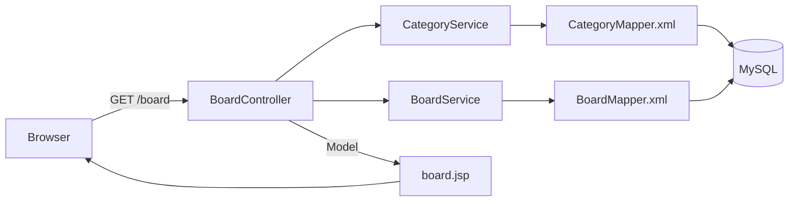

# 철학 자유게시판 (kamel-loewe-kind)

> 철학을 좋아하는 사람들이 모여 자유롭게 생각을 나누는 게시판입니다.

화면 기획 → DB 설계 → 백엔드/프론트 구현 순서로 진행 중인 개인 학습 프로젝트입니다.

## 목차

- [프로젝트 소개](#프로젝트-소개)
- [기술 스택](#기술-스택)
- [주요 기능](#주요-기능)
- [시스템 아키텍처](#시스템-아키텍처)
- [ERD](#erd)
- [설계 의도](#설계-의도)
- [엔티티·DTO 설계 의도](#엔티티dto-설계-의도)
- [문제해결 사례](#문제해결-사례)

## 프로젝트 소개

Spring MVC와 MyBatis를 실전처럼 다뤄보기 위해 시작한 개인 학습 프로젝트입니다. 실무 절차를 흉내 내어 **화면 기획서 작성 → DB 스키마 설계 → 백엔드 구현** 순서로 진행하며, 각 단계에서 내린 판단과 그 이유를 코드와 문서에 남기는 것을 목표로 합니다.

- 화면 기획서(`docs/`): 게시판 목록·보기·등록·수정·비밀번호 확인 5개 화면의 와이어프레임과 기획 의도를 정리했습니다.
- DB 설계(`schema.sql`): `category`, `board`, `comment`, `attachment` 4개 테이블과 외래키 제약을 설계했습니다.
- 백엔드 구현: 현재 카테고리 목록 조회와 게시판 목록 검색(카테고리 필터/통합 검색어/등록일 기간) 기능까지 구현되어 있으며, 게시글 상세·등록·수정·삭제와 댓글·첨부파일 기능은 순차적으로 구현할 예정입니다.

## 기술 스택

| 구분 | 스택 |
|---|---|
| Language | Java 17 |
| Framework | Spring Boot 3.5, Spring MVC |
| Persistence | MyBatis 3.x |
| Database | MySQL 8.0 |
| View | JSP, JSTL (Tomcat Embed Jasper) |
| Build | Gradle (war 패키징) |
| Test | JUnit 5, Spring Boot Test (`@SpringBootTest` 기반 Mapper 통합 테스트) |
| 기타 | Lombok |

## 주요 기능

**구현 완료**

- 게시판 목록 조회: 카테고리별 필터링, 제목/작성자/내용 통합 검색, 등록일 기간 검색을 조합한 조건 검색
- 카테고리 목록 조회: 목록 화면 상단 드롭다운에 노출할 카테고리 목록 조회

**기획·설계 완료, 구현 예정**

- 게시글 상세 보기 (조회수 증가 포함)
- 게시글 등록 / 수정
- 게시글 삭제 전 비밀번호 확인 (페이지 이동 없이 `fetch()` 기반 부분 처리)
- 댓글, 첨부파일 (DB 스키마 설계 완료, 게시글 삭제 시 `CASCADE` 자동 정리)

## 시스템 아키텍처

계층은 `Controller → Service → Mapper(MyBatis) → MySQL`로 이어지며, 화면 렌더링은 JSP가 `Model`에 담긴 데이터를 받아 처리합니다.

테이블 컬럼과 1:1로 대응하는 엔티티(`Board`, `Category`)와, 여러 테이블을 조합해야 하는 화면 전용 응답(`BoardListResponseDto`, `CategoryResponseDto`)을 분리한 이유는 [엔티티·DTO 설계 의도](#엔티티dto-설계-의도)에서 자세히 다룹니다.

## ERD

추후 추가 예정입니다.

## 설계 의도

`schema.sql`을 작성하면서 내린 판단 중, 코드만 봐서는 이유가 드러나지 않는 것들을 정리했습니다.

| 결정 | 한 줄 요약 |
|---|---|
| 외래키에 이름을 직접 지정 | 에러 메시지·수정 시점에 어떤 제약인지 바로 알아보기 위해 |
| `updated_at`을 자동 갱신하지 않음 | 조회수 증가까지 "수정"으로 오인되는 걸 막기 위해 |
| `board → category`는 RESTRICT | 카테고리는 게시글과 독립적으로 의미 있는 데이터라서 |
| `comment/attachment → board`는 CASCADE | 게시글에 완전히 종속된 데이터라서 |

<b>외래키 제약에 이름을 직접 붙인 이유</b>

`fk_board_category`, `fk_comment_board`, `fk_attachment_board`처럼 모든 외래키 제약에 `fk_테이블_참조테이블` 패턴으로 이름을 직접 붙였습니다. 이름을 안 붙여도 MySQL이 알아서 이름을 지어주지만, 알아보기 어려운 자동 생성 이름 대신 의미가 드러나는 이름을 쓰면 두 가지가 편해집니다.

- 제약 위반으로 에러가 났을 때, 에러 메시지에 이 이름이 그대로 나와서 어떤 관계 때문에 실패했는지 바로 알 수 있습니다.
- 나중에 `ALTER TABLE ... DROP FOREIGN KEY fk_board_category`처럼 특정 제약만 콕 집어 수정하거나 삭제할 때, 예측 가능한 이름으로 바로 참조할 수 있습니다.

<b><code>updated_at</code>을 자동으로 채우지 않은 이유</b>

`updated_at`은 `ON UPDATE CURRENT_TIMESTAMP` 같은 자동 갱신을 쓰지 않고, `NULL`을 허용하는 컬럼으로만 두었습니다. 대신 게시글을 실제로 수정하는 쿼리에서만 애플리케이션이 직접 값을 채웁니다.

이유는 게시글 보기 화면에서 조회수를 올리는 동작도 `board` 테이블에 대한 UPDATE이기 때문입니다. 자동 갱신을 걸어두면 글을 조회만 해도 `updated_at`이 채워져서, "수정한 적 없는 글은 '-'로 표기한다"는 화면 요구사항과 어긋나게 됩니다. 조회수 갱신과 실제 수정을 DB가 구분하지 못하는 상황을 피하기 위해, 수정일시는 의도적으로 수동 관리합니다.

<b><code>board → category</code>를 RESTRICT로 둔 이유</b>

카테고리는 게시글이 없어도 그 자체로 의미가 있는 데이터입니다(분류 체계). 그래서 게시글이 참조하고 있는 카테고리를 실수로 지우는 상황을 막기 위해, 기본 동작(RESTRICT)을 그대로 두었습니다. 참조 중인 카테고리를 삭제하려 하면 DB가 거부합니다.

<b><code>comment → board</code>, <code>attachment → board</code>를 CASCADE로 둔 이유</b>

댓글과 첨부파일은 게시글 없이는 존재할 이유가 없는, 게시글에 완전히 종속된 데이터입니다. 게시글이 삭제되면 이 데이터들도 함께 정리되는 게 자연스러워서 `ON DELETE CASCADE`를 걸었습니다. 이렇게 하면 게시글만 지워도 댓글·첨부파일 행이 자동으로 같이 삭제되어, "게시글은 없는데 댓글만 남아있는" 고아 데이터가 생기지 않습니다.

단, CASCADE는 DB 안의 행만 정리해줄 뿐 서버에 실제로 업로드된 파일까지 지워주지는 않습니다. 첨부파일의 실제 삭제는 애플리케이션 코드에서 별도로 처리해야 합니다.

## 엔티티·DTO 설계 의도

게시판 목록 조회(`BoardMapper.search`)를 구현하면서 내린 판단들입니다.

<b><code>Board</code> 엔티티에 <code>hasAttachment</code>를 넣지 않은 이유</b>

JPA였다면 `@OneToMany`로 첨부파일과의 연관관계를 엔티티에 선언해두고, 필요할 때 Hibernate가 알아서 조회해서 채워줬을 겁니다. 하지만 MyBatis에는 이런 자동 fetch 메커니즘이 없습니다 — 리턴 타입에 필드를 선언해봤자, 그 쿼리의 SELECT 결과에 없으면 그냥 기본값(`false`)으로 남을 뿐입니다.

문제는 여기서 끝나지 않습니다. `Board`를 결과 타입으로 쓰는 다른 쿼리(등록, 수정, 단건 조회 등)에서는 `hasAttachment`가 항상 `false`로 채워진 채 반환되는데, 이건 단순히 "비어있다"가 아니라 "실제로는 첨부파일이 있는데도 없다고 잘못 알려주는" 조용한 버그로 이어질 수 있습니다.

그래서 `board` 테이블과 1:1로 대응하는 `Board`는 테이블 컬럼만 그대로 담는 역할로 한정하고, 카테고리 이름·첨부파일 존재 여부처럼 여러 테이블을 조합해야 나오는 값은 목록 화면 전용 `BoardListResponseDto`에만 두었습니다. `Board`는 등록/수정/삭제 등 여러 쿼리에서 재사용되는 안정적인 형태로 유지하고, `BoardListResponseDto`는 오직 목록 화면 하나만을 위한 조합이라는 걸 명확히 구분한 것입니다.

<b>쿼리 결과와 응답 DTO 사이에 별도 Row 계층을 두지 않은 이유</b>

MyBatis 쿼리 결과를 한 번 더 감싸는 중간 객체(Row)를 만들고, 그걸 다시 `BoardSearchResponseDto`로 변환하는 계층을 추가하는 방법도 있었습니다. 하지만 지금 단계에서는 쿼리 결과 컬럼과 화면에 필요한 필드가 사실상 1:1이라, 중간 계층을 추가해봤자 코드만 한 겹 늘고 관리 포인트만 늘어난다고 판단해 생략했습니다.

대신 이 결정에는 명확한 대가가 있습니다. XML의 SELECT 컬럼(별칭)과 DTO 필드명이 문자열로만 연결되기 때문에, 나중에 DTO 필드명을 바꾸면서 XML의 별칭을 같이 안 고치면 컴파일 에러 없이 그 필드만 조용히 null/기본값으로 빠지는 사고가 날 수 있습니다. 이런 실수를 컴파일 시점이 아니라 최소한 테스트 시점에는 잡기 위해, DB에 실제로 값을 넣고 쿼리를 돌려 필드까지 검증하는 통합 테스트(`@SpringBootTest` 기반)를 방어선으로 두었습니다.

## 문제해결 사례

구현하면서 실제로 부딪힌 문제와 해결 과정입니다.

<b>사례 1. MyBatis 쿼리 결과가 조용히 버려지던 문제</b>

**문제**: 게시글 목록에 카테고리명과 첨부파일 아이콘을 표시해야 하는데, `BoardMapper.search()`가 반환하는 값에 두 필드가 항상 비어있었습니다. 에러는 하나도 나지 않았습니다.

**원인**: 쿼리의 `resultType`이 `Board`로 지정돼 있었는데, `Board`는 `board` 테이블 컬럼과 1:1로만 대응하는 엔티티라 카테고리명(JOIN 결과)·첨부파일 존재 여부(EXISTS 서브쿼리 결과) 같은 필드가 애초에 없었습니다. SQL은 그 값을 정상적으로 SELECT하고 있었지만, MyBatis가 매핑할 자바 필드를 찾지 못해 그 컬럼들을 조용히 버리고 있었던 것입니다. 컴파일도 되고 쿼리도 성공하기 때문에, 실제로 값을 확인하기 전까지는 문제를 알아챌 방법이 없었습니다.

**해결**: 테이블과 1:1 대응하는 `Board`(엔티티)와, 여러 테이블을 조합한 화면 전용 `BoardListResponseDto`(DTO)를 분리하고, `resultType`을 `BoardListResponseDto`로 맞춰서 두 필드가 실제로 채워지도록 고쳤습니다. 같은 실수가 조용히 재발하지 않도록, 실제 DB에 테스트 데이터를 넣고 쿼리를 실행해 필드 값까지 검증하는 통합 테스트(`BoardMapperTest`)를 추가했습니다. 이 테스트를 만드는 과정에서 XML의 `<=` 비교 연산자가 이스케이프되지 않아 매퍼 파일 자체가 파싱조차 안 되던 별개의 오류도 함께 발견해 고쳤습니다.

<b>사례 2. 페이지 새로고침 없이 삭제 확인을 처리하는 방법</b>

**문제**: JSP는 컨트롤러가 `Model`에 데이터를 담아 넘기면 서버에서 완성된 HTML을 만들어 내려주는 방식이라, 화면 전체를 새로 그리는 데는 적합하지만 "게시글 삭제 전 비밀번호를 확인하고, 틀리면 그 자리에서 알려주는" 것처럼 화면 일부만 바꾸고 싶은 경우와는 잘 안 맞았습니다.

**접근**: 화면 전체를 다시 그려야 하는 요청과, 결과만 확인하고 화면은 그대로 두어도 되는 요청을 구분했습니다. 전자는 브라우저가 알아서 페이지를 이동시켜주는 `<form>` 제출 방식이 그대로 맞고, 후자는 페이지 이동 없이 서버와 값만 주고받는 방식이 필요했습니다.

**해결**: 게시글 목록/보기/등록/수정처럼 화면 전체를 그리는 요청은 기존대로 `@Controller`가 `Model`에 데이터를 담아 JSP로 렌더링하도록 두고, 비밀번호 확인처럼 부분 갱신이 필요한 요청만 `@RestController` + `@RequestBody`/`ResponseEntity`로 분리했습니다. 화면(JSP)에 있는 JavaScript가 `fetch()`로 비밀번호를 서버에 보내고, JSON 응답(`{"success": true/false}`)만 받아 그 값에 따라 `alert`를 띄우거나 페이지를 이동시키도록 처리해, 페이지 전체를 다시 그리지 않고도 삭제 확인 흐름을 구현했습니다.

