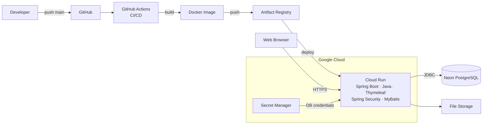

      
# 📌 독서 토론 커뮤니티 서비스

참여하고 있는 독서 토론 모임에서 모임이 끝나면 나누었던 생각과 의견이 이어지지 못하는 점에 아쉬움을 느껴, 모임이 없는 시간에도 구성원들이 자유롭게 소통할 수 있는 서비스를 만들어보고자 시작하게 되었습니다. 자유게시판, 피드 등의 기능을 통해 모임에서 나눈 생각과 의견을 공유할 수 있는 독서 토론 커뮤니티 서비스입니다.

----
# 📌 문제 상황과 해결 방법 

----
# 📌 요구사항 

**1. 회원 기능**
- 사용자는 회원가입, 로그인을 할 수 있다.

**2. 피드 기능**
- 사용자는 피드에서 게시글을 최신순으로 조회하고 추가로 불러올 수 있다.
- 로그인한 사용자는 게시글을 작성, 수정, 삭제할 수 있으며 이미지를 첨부할 수 있다.
- 사용자는 게시글에 댓글을 작성, 수정, 삭제할 수 있다.
- 사용자는 게시글에 좋아요를 등록하거나 취소할 수 있다.
- 게시글에는 작성자, 작성 시간, 내용, 이미지, 좋아요 수, 댓글 수가 표시된다.

**3. 자유게시판 기능**
- 사용자는 자유게시판의 게시글 목록과 상세 내용을 조회할 수 있다.
- 로그인한 사용자는 게시글을 작성, 수정, 삭제할 수 있다.
- 사용자는 게시글에 댓글을 작성, 수정, 삭제할 수 있다.
- 게시글에는 작성자, 작성 시간, 제목, 내용, 댓글 수가 표시된다.

----
# 📌 비기능 요구사항 

**1. 성능**
- 피드 및 자유게시판 조회 요청은 1초 이내 응답하는 것을 목표로 한다.
- 최대 500명의 동시 접속자가 게시글을 조회할 수 있어야 한다.
- 게시글 목록 조회 시 불필요한 데이터 조회를 최소화한다.

**2. 데이터 일관성**
- 동일 사용자가 하나의 게시글에 좋아요를 중복 등록할 수 없어야 한다.
- 게시글 및 댓글의 생성, 수정, 삭제 과정에서 데이터 정합성을 유지해야 한다.
- 게시글 삭제 시 댓글, 좋아요 등 연관 데이터가 일관된 상태로 관리되어야 한다.

**3. 가용성**
- 게시글 작성 및 수정 과정에서 오류가 발생할 경우 데이터가 일부만 저장되지 않아야 한다.

----

# 📌 시스템 아키텍쳐 

```mermaid
flowchart LR
      Dev["Developer"]
      GitHub["GitHub"]
      CICD["GitHub Actions\nCI/CD"]
      Docker["Docker Image"]
      Registry["Artifact Registry"]

      User["Web Browser"]

      subgraph GCP["Google Cloud"]
          CloudRun["Cloud Run\nSpring Boot · Java · Thymeleaf\nSpring Security · MyBatis"]
          Secret["Secret Manager"]
      end

      Neon[("Neon PostgreSQL")]
      File["File Storage"]

      Dev -->|push main| GitHub
      GitHub --> CICD
      CICD -->|build| Docker
      Docker -->|push| Registry
      Registry -->|deploy| CloudRun

      User -->|HTTPS| CloudRun
      Secret -->|DB credentials| CloudRun
      CloudRun -->|JDBC| Neon
      CloudRun --> File
```

----
# 📌 사용 기술

| 구분 | 스택 |
|---|---|
| Language | Java 17 |
| Framework | Spring Boot 3.5, Spring MVC |
| Persistence | MyBatis 3.x |
| Database | PostgreSQL |
| View | JSP, JSTL (Tomcat Embed Jasper) |
| Build | Gradle (war 패키징) |
| Test | JUnit 5, Spring Boot Test (`@SpringBootTest` 기반 Mapper 통합 테스트) |

----
# 📌 데이터 아키텍쳐 

----
